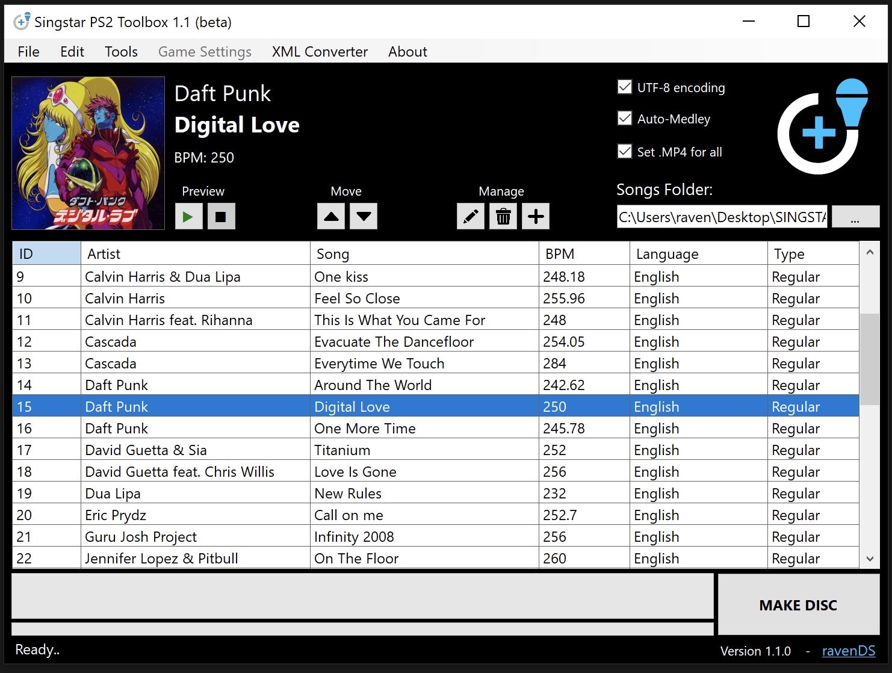

# SingStar PS2 Toolbox
A Custom Disc Creator for SingStar. Create custom SingStar discs with your own songs!

Every external tool used by [SingStar Creator v3](https://github.com/weathondev/SingstarCreatorTutorial) has been entirely rewritten in VB.Net.

### Main Features
- Import & convert [Performous](https://github.com/performous/performous)/UltraStar songs (txt)
- Convert audio & video to proprietary SingStar format (IPU + MIB)
- Export songs from other SingStar discs to use in your own
- Build an ISO compatible with emulators & real hardware (PS2/PS3)

### QoL Features
- No external tools (apart from ffmpeg)
- M2V to IPU converter (no SDK needed)
- Audio normalization for consistent volume
- Entirely rewritten TXT to XML converter
- Support for regular, duet, rap songs
- Fix text encoding automatically

### Setup & Requirements
- #### Download the latest version of ffmpeg.exe <a href="https://www.gyan.dev/ffmpeg/builds/ffmpeg-git-full.7z">(direct link for Win10)</a> and place it in the same folder as Singstar Toolbox.
- .NET 8.0 Desktop Runtime

# Roadmap 
***Note:** Building a PS3 song library is 100% done, coming in v1.3.*
### In progress
- [ ] **GLOBAL:** Drag & Drop songs (TXT & SST2)
- [ ] **GLOBAL:** Divide BPM & notes when BPM is too high
- [ ] **GLOBAL:** yt-dlp support (for .TXTs with external videos)
- [ ] **PS2:** Medley Editor
- [ ] **PS2:** Edit boot logos (TGA support)
- [ ] **PS2:** Support NTSC (IAV+IND)
- [x] **GLOBAL:** Extract audio from video (for .TXTs with video only)
- [x] **GLOBAL:** Convert PS2 songs to PS3
- [x] **GLOBAL:** Convert PS3 multi-channel audio to stereo for PS2 (no loss)
- [x] **GLOBAL:** Convert PS3 songs to PS2
- [x] **PS3:** Auto-decrypt supported ISOs when needed
- [x] **PS3:** NTSC video support
- [x] **PS3:** PS3 Full Support
- [x] **PS3:** Export/Build PS3 Data
- [x] **PS3:** Update existing song library via FTP
### Completed ([v1.2](https://github.com/RavenDS/singstar-toolbox/releases/latest))
- [x] **GLOBAL:** Edit videos to include time gap
- [x] **ISO:** ISO Rebuilding
- [x] **PS3:** Global PS3 support (XML, video, audio, structure)
- [x] **PS3:** Video/audio encoding (with ReplayGain)
- [x] **PS2:** PAK file Unpacking/Repacking
- [x] **PS2:** M2V to IPU conversion
- [x] **PS2:** IPU swizzling
- [x] **PS2:** 99% codec compatibility
- [x] **PS2:** Audio Encode to ADPCM
- [x] **PS2:** MIB + MIH export 
- [x] **PS2:** BMP to TX2 + TX2 to BMP
- [x] **PS2:** Import songs from other discs
- [x] **PS2:** Edit/disable menu music
- [x] **PS2:** Multiple Language support (English, French, German, Italian)
# Credits
- <a href="https://ffmpeg.org/">ffmpeg</a>
- [DiscUtils.Iso9660](https://github.com/DiscUtils/DiscUtils)
- [NAudio](https://github.com/naudio/NAudio)
- [Ude.NetStandard](https://github.com/errepi/ude)
- [nQuant](https://www.nuget.org/packages/nQuant)
- [ss_cover.cc](https://github.com/performous/performous-tools/blob/master/ss_cover.cc) *(TX2 to BMP conversion)* 
- Holger Kuhn (hawkear@gmx.de) for his work on SingStar overall
- Special thanks to @locastan for his help

## Notes
It is possible to add more than 100 songs to a single disc, however it might cause unexpected behaviour in-game. 
